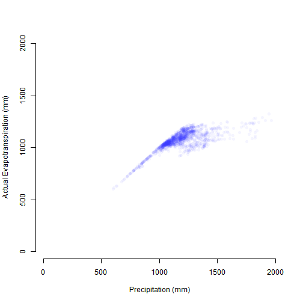

Course project: Data Products (ShinyApp)
========================================================
author: Edgar Rodríguez-Huerta
date: 2020-09-03
autosize: true

Prediction of Actual Evapotranspiration (AET) using Precipitation data
========================================================
The following project is part of the Data Science Specialization by Johns Hopkins Universiy (Coursera).

The ShinyApp predicts the Actual Evapotranspiration in Yucatán Península, México, using Precipitation data.

Data source:
*Rodríguez-Huerta, Edgar, Rosas-Casals, M., & Hernández-Terrones, L. M. (2019a). A water balance model to estimate climate change impact on groundwater recharge in Yucatan Peninsula, Mexico. Hydrological Journal Sciences, 12. https://doi.org/https://doi.org/10.1080/02626667.2019.1702989*

Models
========================================================

wo models were applied for the prediction:
- Lineal regression: lm function.
- Michaelis-Menten model: With the library `drc` and the function `MM.2` 


Getting data
========================================================

For storage limitations, original data was randomly cut (around 90%)


```r
library(shiny)
library(drc)
data <- read.csv("LULC-BioclimaticParameters.csv", encoding = "UTF-8")
data2<-data
```

Description of the plot
========================================================

The x-axis represent historical Precipitation (mm) and y-axis the result AET with Hamon method.



Modeling
========================================================

Lineal Regression and Michaelis-Menten model


```r
model1 <- lm(ETa.HAM ~ P,data2)
model1$coef
```

```
(Intercept)           P 
658.7694466   0.3170402 
```

```r
model2 <- drm(ETa.HAR ~ P, data=data2, fct=MM.2() )
model2$coef
```

```
d:(Intercept) e:(Intercept) 
    1732.4158      713.7368 
```

Conclusions
========================================================

- Although the MM model fits the sample better, there is no significant difference.
- An inferential statistical analysis is necessary to confirm the assumptions.
- It should be compared with other AET methods (Hargreaves or Blaney).

